# OptiCal
The electron forge (hopefully final) version of OptiCal. 

In-house software designed to query Opti O2 dissolved oxygen sensors.

# Installation
If the user needs to create a new installer, after cloning the github repository run 

    npm run make

from the command line in the directory you cloned to. The installer will be located in .\out\make\squirrel.windows\x64. After running the installer, a shortcut to the installed version of OptiCal should be created on your desktop.

# Usage
Upon launching OptiCal, the user will be presented with this window. The application is fully responsive, and the main window is resizable to a minimum of 1280x720.

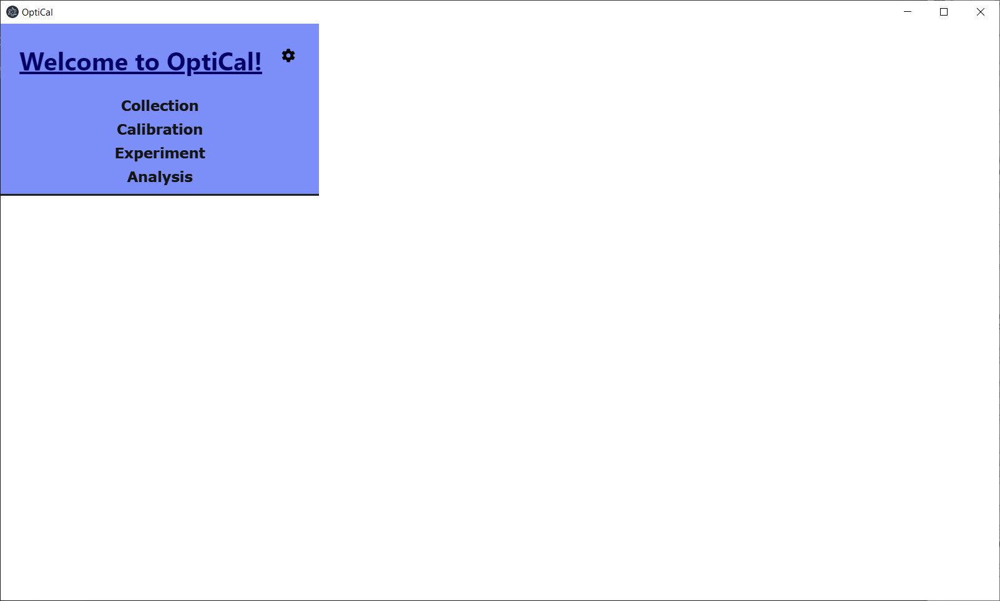

The first thing a user will need to do is click the gear icon on the left panel to open up the main settings window, then set their desired data storage directory and default pressure (this will only need to be done the first time launching OptiCal, unless the user decides to change their data storage directory/default pressure in the future).

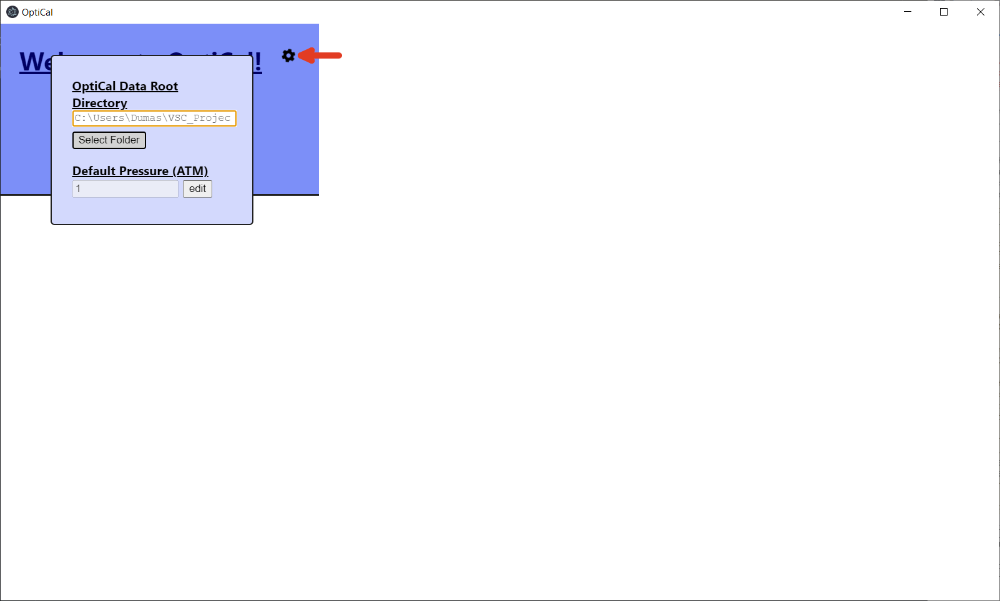

Now the user is ready to start using OptiCal!

---
  ### Data Collection
  
  If the user would like to collect any generic (non-calibration) data using OptiCal, click the indicated Collection tab to open up the Collection sidebar.
  
  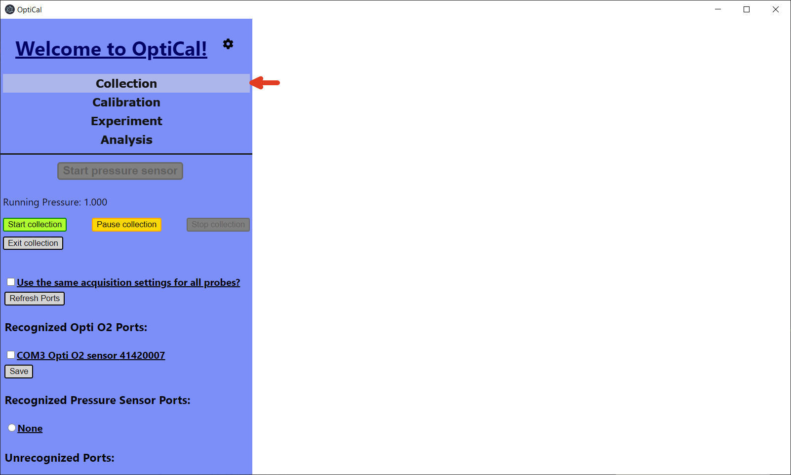
  
  If the user is planning on using the same acquisition settings for all probes, click the checkbox next to "Use the same acquisition settings for all probes" and then click the indicated Save Acquisition Settings button once you have your desired acquisition settings input.
  
  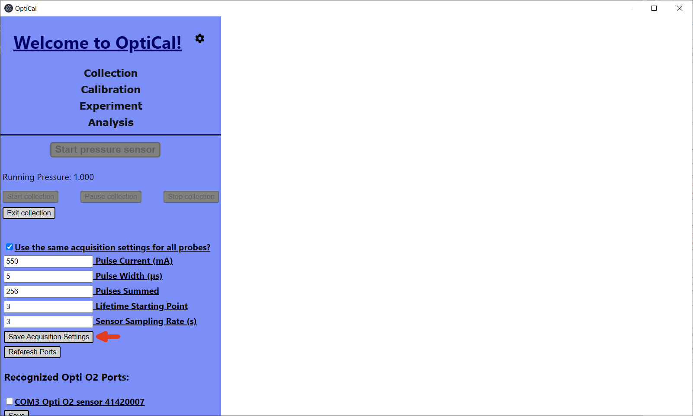
  
  Now the user must select the Opti O2 probes they wish to query. If not all connected probes are showing up under "Recognized Opti O2 Ports:" (e.g. the user connected probes after opening the collection tab), click the Refresh Ports button (1). If you have an Opti O2 pressure sensor connected, it will show up under "Recognized Pressure Sensor Ports:". Once the user has all their desired sensors selected click the Save button (2).
  
  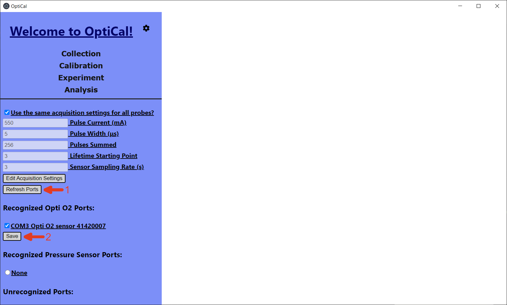
  
  After the user has selected their sensors and clicked Save, they will see the right side of the OptiCal window be populated with a settings window. If the user has decided not to use the same acquisition settings for all probes, this is where they will set the individual settings. The user MUST input a Film ID and then click the Submit Film ID button to begin collecting data. If the user has a calibration file they would like to use for data collection, click the Select Calibration File button to navigate to said calibration file. Once the user has finished inputting all parameters, click the Okay button (if multiple probes are selected, scroll down to see the rest).
  
  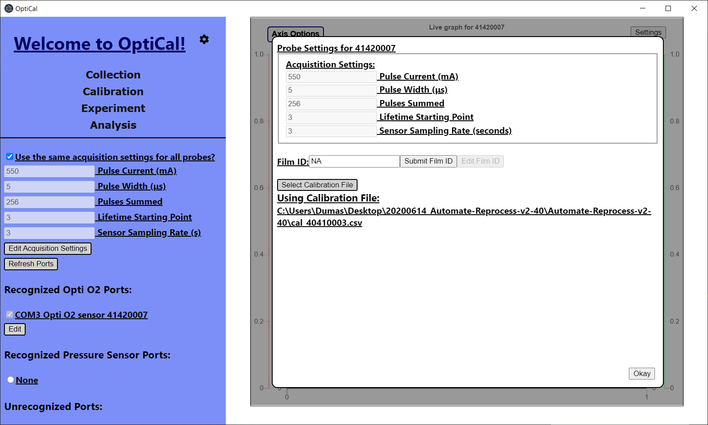
  
  Now that the user has all their data collection parameters set, they can scroll back up on the left sidebar and click the green Start collection button. (If the user has a supported pressure sensor connected make sure to click the Start pressure sensor button BEFORE clicking the Start collection button).
  
  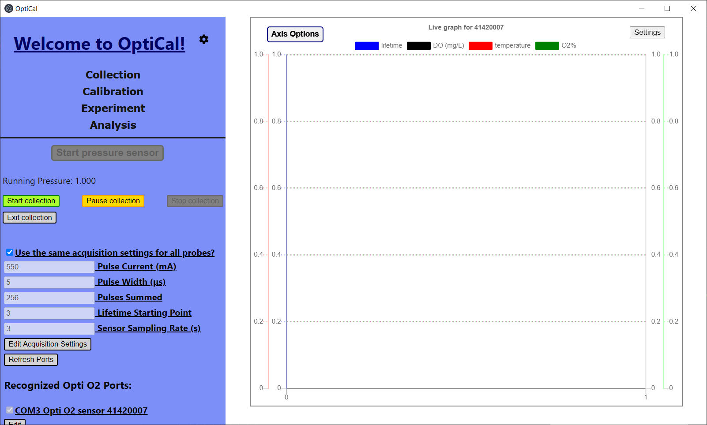
  
  Once the user has begun collecting data, the graph(s) on the right will begin to update in real time. The yellow Pause collection button allows the user to pause and unpause data collection while still writing to the same file, while the Stop collection button will stop data collection entirely. The user can hover their cursor over any of the points on the graph(s) to see the exact values of said points.
  
  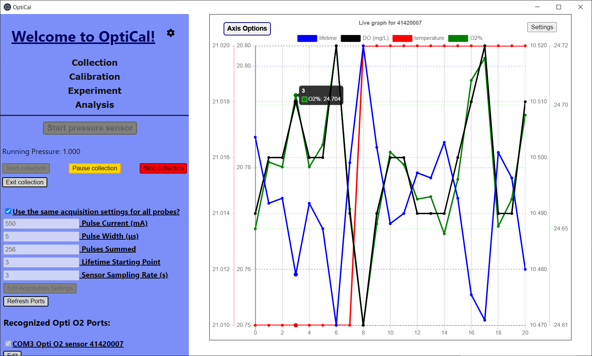
  
  If the user would like to modify any of the axes' ranges or change which traces are visible on the graph, they can do so by clicking the indicated Axis Options button on the top left of the graph to display the Axis Options window (there will be separate axis options for each graph if the user is querying multiple probes). If the user would like to set a manual range for an axis, they must first uncheck the respective 'auto' checkbox first (checking it again later will set the axis back to auto scaling). Once the user has finished making their modifications, click the Axis Options button again to hide the window.
  
  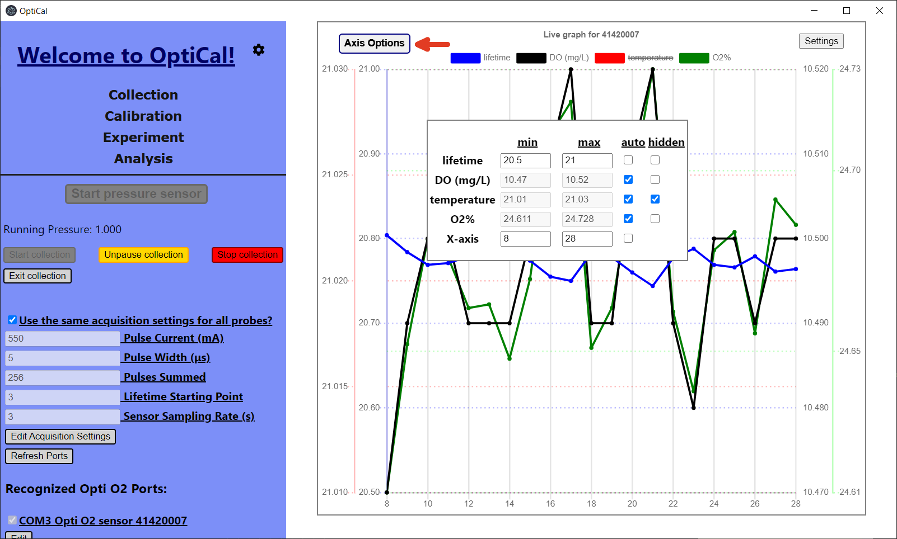
  
  
  ---
  ### Running a Calibration
  
  If the user would like to calibrate Opti O2 probes using OptiCal, click the indicated Calibration tab to open up the Calibration sidebar.
  
  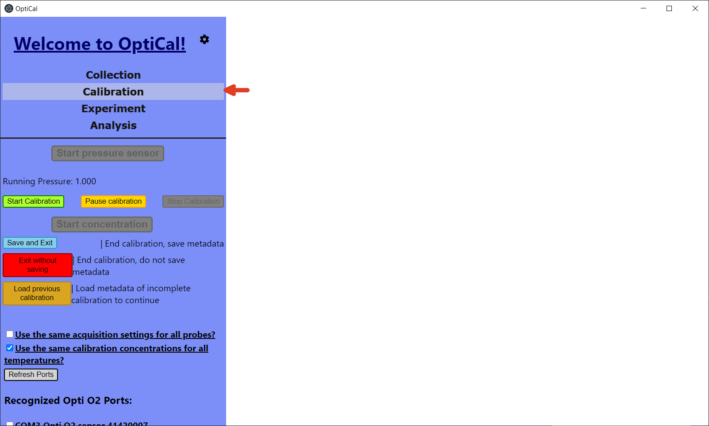
  
  Setup for calibration is much the same as with data collection, so refer to that section for information on setting acquisition settings and adding probes. After adding probes, the user may notice an additoinal section at the bottom of the Calibration sidebar for inputting the temperatures and oxygen concentrations to be used in the calibration. After entering the desired concentrations and temperatures, click the indicated Save Concentrations and Temperature button. 
  
  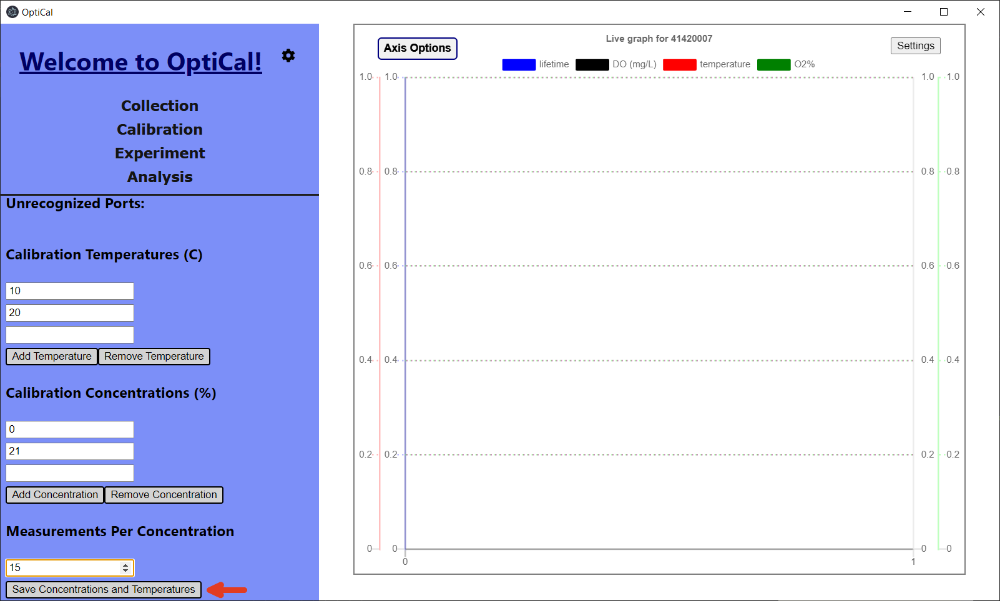
  
  After the user has finished entering all the parameters for this calibration, they can scroll back to the top of the Calibration sidebar and click the green Start Calibration button. The Start/Pause/Stop buttons at the top of the Calibration sidebar, as well as the Start pressure sensor button, function the same as the corresponding buttons in the Collection tab. The first new button the user will want to direct the attention to is the indicated Start Concentration button. Once the user has determined that they've reached equilibrium for an oxygen concentration, click this button to begin collecting the specified number of datapoints for this concentration.
  
  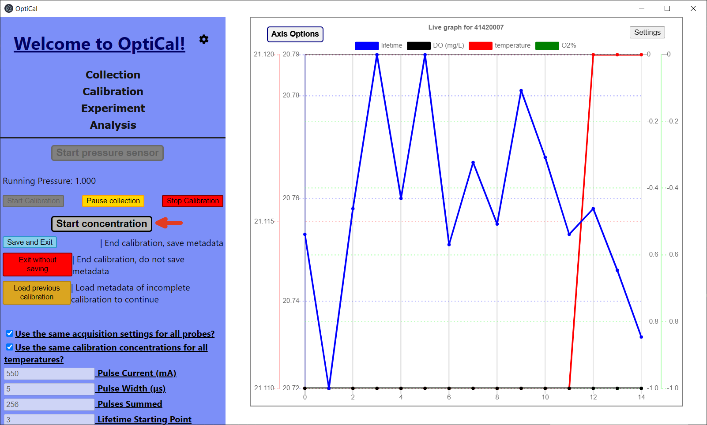
  
  Once the specified number of datapoints have been collected for the current concentration, the user will see OptiCal bring up this window. If the user is satisfied with the results of the current concentration, click the green Accept button to continue the calibration. If the user is unsatisfied with the recorded standard deviations, or any problems occurred during this concentration, Click the yellow Reject and rerun button to attempt collecting data again (the next time the user clicks the Start Concentration button, OptiCal will begin collceting data for this same oxygen concentration again) or click the red Reject and skip button to continue the calibration without attempting the same concentration (the next time the user clicks the Start Concentration button, OptiCal will begin collceting data for the next oxygen concentration in the queue).

  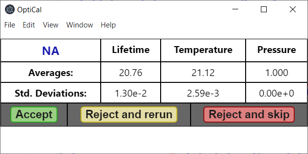

  If the user ever loses track of what concentration they're supposed to be on, they can scroll down to the bottom of the Calibration sidebar to view the temperatures/concentrations they entered at the start of the calibration: the current temperature/concentration will be outlined in blue, and the upcoming temperature/concentration will be highlighted in green. Completed temperatures/concentrations will be outlined in red.

  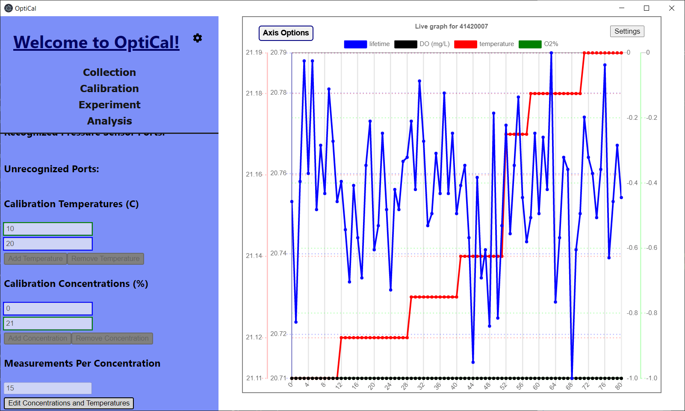
  
  Once the calibration is complete, the user can scroll to the top of the Calibration sidebar and click the Stop Calibration button, then click the Exit without saving button to complete the calibration. If the user needs to interrupt the calibration to be resumed later (e.g. when transition between temperatures), they should first click Stop Calibration then click the blue Save and Exit button to save the calibration metadata. When the user is ready to resume the calibration, they can click the Load previous calibration button to navigate to the folder where the interrupted calibration is saved.
  
  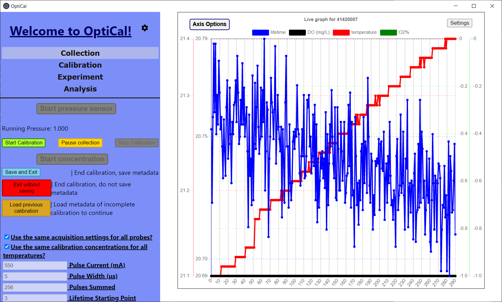
  
  Additionally, OptiCal has functionality to automatically generate a calibration file from a complete calibration dataset. Refer to the section on the Analysis tab for further info.
  
  ---
  ### Experiments
  
  The Experiment tab is designed for Opti O2's in house tests to determine the effects of using different acquisition settings with the same sensors. Based on whether the indicated checkbox is checked or not, OptiCal will either collect all datapoints for one set of scquisition settings before moving onto the next, or collect one datapoint for each set of acquisition settings before moving onto the next datapoint. 
  
  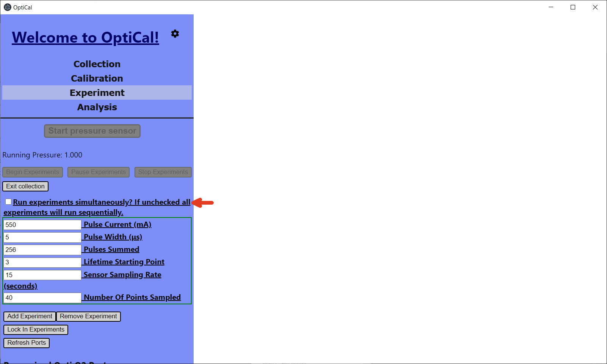
  
  The user will first need to click the Add Experiment box until the desired number of acquisition settings to be compared are displayed, then edit each set of acquisition settings as desired. Note that only the first set of acquisition settings will accept a sampling rate and number of points to sample if the user opts to run experiments simultaneously. Once the User has finalized all their different acquisition settings, click the Lock In Experiments button and proceed with setup the same as in the Collection tab.
  
  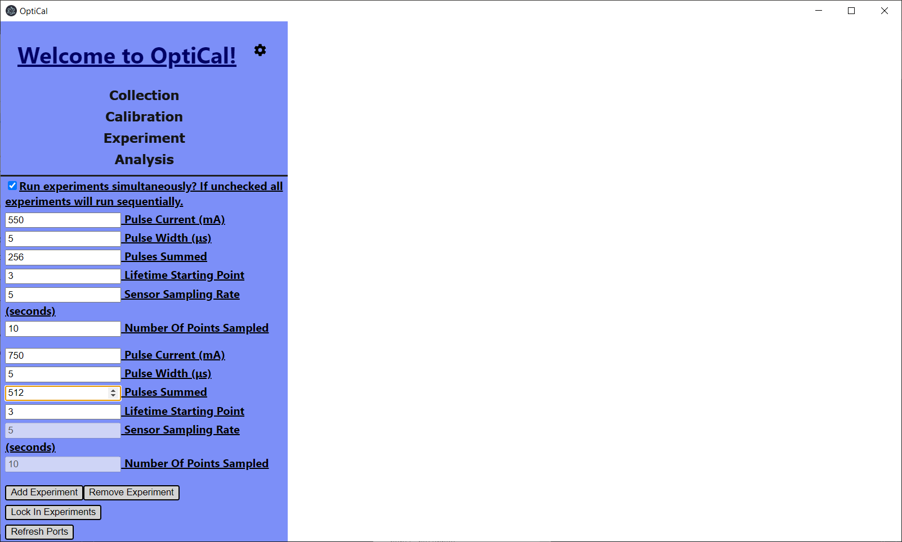
  
  ---
  ### Analysis
  
  The analysis tab contains various additional functionality that complements the core data collection/monitoring functionality of OptiCal. 
  
  1. Generating a calibration file
      
      To generate a calibration file from a full calibration dataset collected with OptiCal, click the indicated Select Calibration Data Folder button. Use the file explorer to navigate to the folder with your calibration data and select it.
      
      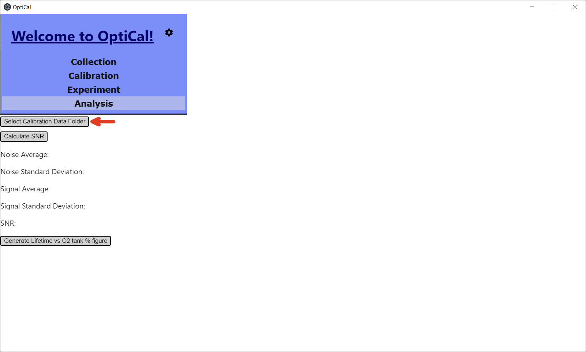
      
      After the user has selected their calibration data folder, input the recorded mercury thermometer tempreatures and click the Submit button. After clicking Submit, a Generate calibration file button will appear above; click this and a calFile.csv will be generated in the selected calibration data folder.
      
      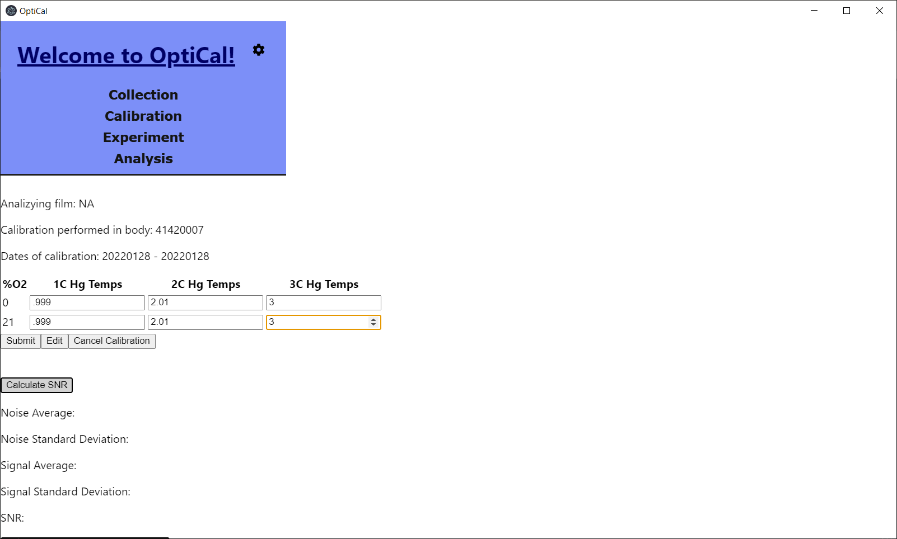
      
  2. Generating lifetime vs oxygen concentration figure
      
      To generate a lifetime vs oxygen tank concentration figure from a calibration dataset collected with OptiCal, click the indicated Generate Lifetime vs O2 tank % figure button. Navigate to the folder containing the appropriate calibration data and select it; a graph will be generated at the bottom of the screen.
      
      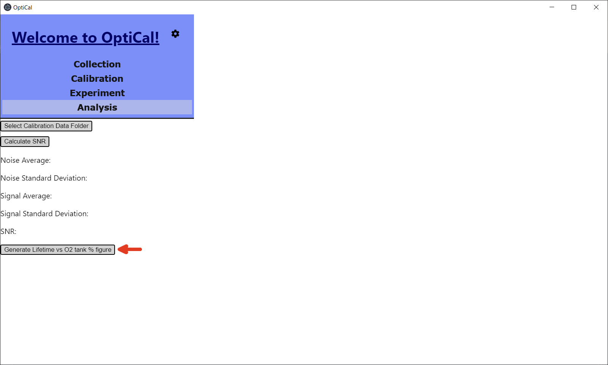
      
  3. Calculating SNR
  
      If the user would like to get a signal-to-noise ratio for any individual datafile, simply click the indicated Calculate SNR button, navigate to and select the datafile in question with the file explorer, and the fields below the Calculate SNR button will automatically be populated with the values calculated by OptiCal.
      
      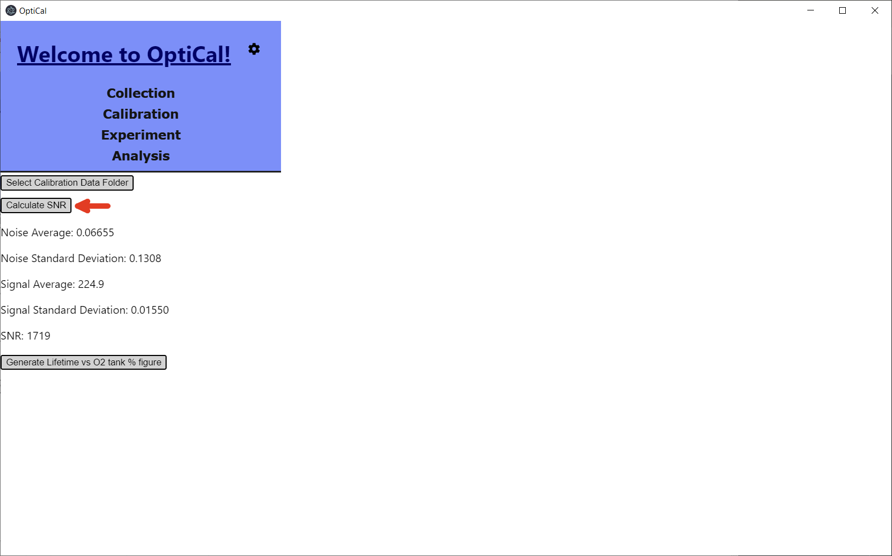
